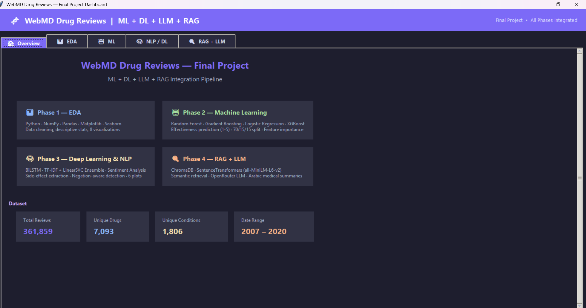
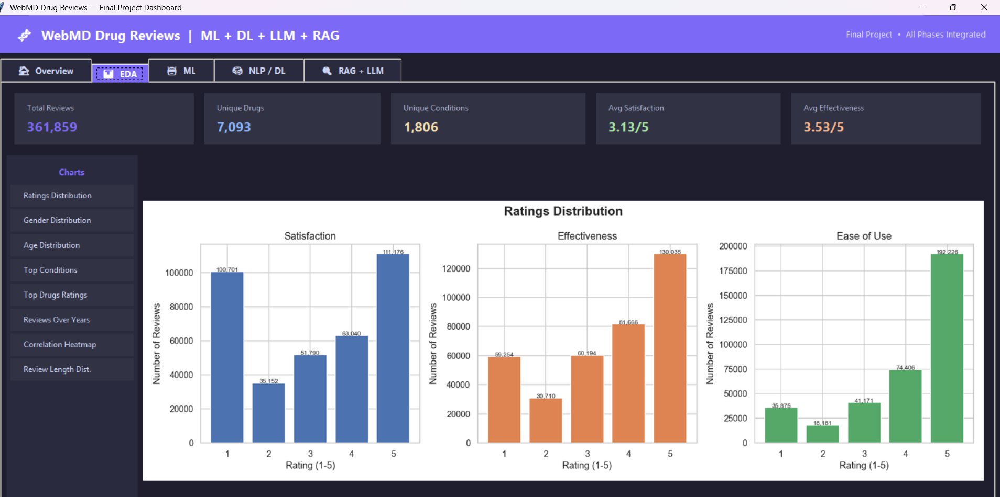
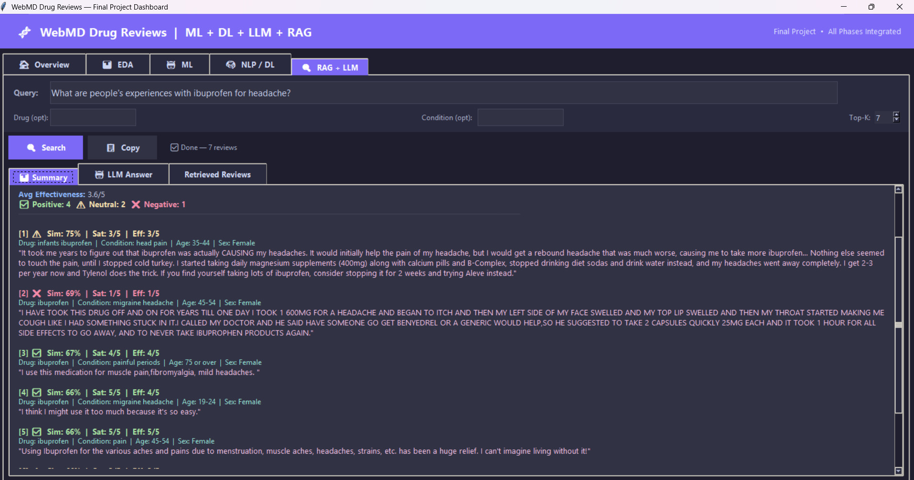

# WebMD Drug Reviews — AI Pipeline (ML + DL + RAG + LLM)

A full end-to-end AI pipeline built on the WebMD Drug Reviews dataset. The project spans five phases: exploratory data analysis, classical machine learning, deep learning NLP, a RAG retrieval system, and an LLM-powered answer generation layer — all unified in a single interactive desktop dashboard.

---

## Overview



---

## Table of Contents

- [Project Structure](#project-structure)
- [Pipeline Phases](#pipeline-phases)
- [Dataset](#dataset)
- [Installation](#installation)
- [Usage](#usage)
- [Environment Variables](#environment-variables)
- [Models & Results](#models--results)
- [Tech Stack](#tech-stack)

---

## Project Structure

```
webmd-ai-pipeline-ml-rag-llm/
├── analysis.py              # Phase 1: EDA & data cleaning
├── ml_model.py              # Phase 2: ML effectiveness prediction
├── dl_nlp.py                # Phase 3: BiLSTM sentiment analysis
├── rag_system.py            # Phase 4+5: RAG + LLM drug Q&A
├── app.py                   # Unified Tkinter dashboard (all phases)
├── gradio_demo.py           # Gradio web demo (Colab-ready)
├── WebMD_AI_Pipeline.ipynb  # Jupyter notebook walkthrough
├── requirements.txt         # All dependencies
├── README.md                # This file
├── PROJECT_EXPLANATION.md   # Detailed concept explanation
├── .env                     # API keys (not committed)
├── .gitignore               # Git ignore rules
├── webmd.csv                # Raw dataset (download separately)
├── webmd_cleaned.csv        # Cleaned dataset (output of Phase 1)
├── rf_effectiveness_model.pkl  # Saved best ML model
├── lstm_sentiment_model.keras  # Saved BiLSTM model
├── plots/                   # EDA output plots (8 charts)
├── ml_plots/                # ML output plots (5 charts)
├── nlp_plots/               # NLP/DL output plots (6 charts)
├── chroma_db/               # ChromaDB persistent vector store
└── image/                   # Screenshots for README
```

---

## Pipeline Phases

### Phase 1 — Exploratory Data Analysis



Loads and cleans the raw WebMD CSV, then generates 8 visualizations:

- Ratings distribution (Satisfaction, Effectiveness, Ease of Use)
- Gender and age group demographics
- Top 15 medical conditions by review count
- Average ratings for the top 10 most-reviewed drugs
- Review volume trend over the years
- Correlation heatmap across numeric features
- Review length distribution with mean/median markers

Cleaning steps applied:
- Fill missing text columns (`Age`, `Condition`, `Sex`, `Sides`, `Reviews`) with `"Unknown"`
- Fill missing numeric ratings with column median
- Parse and extract year from date field
- Remove duplicate rows
- Filter out-of-range ratings (outside 1–5)
- Compute `Review_Length` as character count

Output: `webmd_cleaned.csv` — used by all subsequent phases.

---

### Phase 2 — Machine Learning


Predicts drug `Effectiveness` rating (1–5) as a 5-class classification problem.

**Features used:**
| Feature | Description |
|---|---|
| Age_Num | Age group mapped to numeric midpoint |
| Sex_Enc | Binary encoded (Female=1, Male=0) |
| Condition_Enc | Label-encoded top-50 conditions |
| EaseofUse | Rating 1–5 |
| Satisfaction | Rating 1–5 |
| UsefulCount | Number of users who found review helpful |
| Year | Review year |
| Review_Length | Character count of review text |

**Models trained:**
| Model | Notes |
|---|---|
| Random Forest | 200 trees, max depth 15 |
| Gradient Boosting | 100 estimators, learning rate 0.1 |
| Logistic Regression | StandardScaler pipeline, max_iter 500 |
| XGBoost | 300 estimators, learning rate 0.05, early stopping on val set |

**Split:** 70% train / 15% validation / 15% test (stratified)

Best model is selected by weighted F1 on the test set and saved to `rf_effectiveness_model.pkl`.

The dashboard includes a live predictor — fill in patient details and get an effectiveness prediction with confidence score.

---

### Phase 3 — Deep Learning NLP


Binary sentiment classification on drug reviews (Positive = Satisfaction ≥ 4, Negative = Satisfaction ≤ 2, neutral class 3 dropped as noise).

**Data:** Up to 80,000 balanced samples (40k positive, 40k negative).

**Text preprocessing:**
- Lowercase, HTML tag removal
- Contraction expansion (`n't` → `not`, `'re` → `are`, etc.)
- Remove non-alphabetic characters
- Preserve sentiment-bearing stopwords (`not`, `very`, `but`)

**Models:**

1. TF-IDF Ensemble (primary model)
   - Word n-grams (1–3) + character n-grams (2–4), 150k features each
   - LinearSVC (C=1.0, calibrated with 3-fold CV) + Logistic Regression (C=5.0, SAGA solver)
   - Ensemble: 50% SVC + 50% LR probabilities

2. Bidirectional LSTM (secondary model)
   - Vocabulary: 30,000 tokens, max sequence length: 150
   - Embedding dim: 128
   - Architecture: `Embedding → SpatialDropout(0.5) → BiLSTM(32) → Dense(16, ReLU) → Dropout(0.6) → Sigmoid`
   - Optimizer: Adam (lr=5e-4), EarlyStopping (patience=2), ReduceLROnPlateau
   - GPU support with mixed precision if available

3. Final Ensemble: 80% TF-IDF + 20% LSTM probabilities

**Side-effect extraction:**
- Keyword matching against 50 known medical side-effect terms
- Negation-aware: checks 5-word window before each keyword for negation terms (`not`, `never`, `no`, `without`, etc.)
- Normalized frequency comparison between positive and negative reviews

The dashboard includes a live analyzer — paste any review text and get sentiment label, confidence score, and detected side effects.

---

### Phase 4+5 — RAG + LLM System



A Retrieval-Augmented Generation system that answers natural language questions about drugs by grounding responses in real patient reviews.

**Vector Index:**
- Embedding model: `all-MiniLM-L6-v2` (SentenceTransformers)
- Vector store: ChromaDB with cosine similarity (HNSW index)
- 50,000 reviews indexed in batches of 512
- Each document combines: drug name, condition, sentiment, effectiveness rating, side effects, and review text

**Retrieval:**
- Semantic search with optional metadata filters (drug name, condition)
- Configurable top-k results (default: 7)
- Returns similarity score, drug, condition, satisfaction, effectiveness, age, sex per hit

**LLM Generation (optional):**
- Provider: OpenRouter API (OpenAI-compatible)
- Default model: `nvidia/nemotron-3-super-120b-a12b:free`
- System prompt instructs the model to summarize only from retrieved context — no hallucination
- Falls back to a structured template response if no API key is set or LLM call fails

**Dashboard features:**
- Arabic-language UI with RTL text support
- Summary tab with color-coded sentiment output
- Reviews table with per-row sentiment coloring
- Detail panel showing full review text on row selection
- Copy-to-clipboard button for the full response
- Drug and condition filter fields

---

## Dataset

[WebMD Drug Reviews](https://www.kaggle.com/datasets) — patient-submitted reviews including:

| Column | Description |
|---|---|
| Drug | Drug name |
| Condition | Medical condition treated |
| Reviews | Free-text patient review |
| Sides | Reported side effects |
| EaseofUse | Rating 1–5 |
| Effectiveness | Rating 1–5 |
| Satisfaction | Rating 1–5 |
| UsefulCount | Helpfulness votes |
| Sex | Patient gender |
| Age | Patient age group |
| Date | Review submission date |

The raw file (`webmd.csv`, ~168MB) is not committed to the repository. Download it from Kaggle and place it in the project root before running Phase 1.

---

## Installation

### Prerequisites
- **Python 3.10 or 3.11** (⚠️ Python 3.13 not supported yet due to library compatibility)
- pip package manager
- (Optional) GPU with CUDA for faster deep learning training

### Step 1: Check Python Version
```bash
python --version
# Should show Python 3.10.x or 3.11.x
```

**If you have Python 3.13 or 3.12:**
```bash
# Create environment with Python 3.11
conda create -n webmd python=3.11
conda activate webmd
```

### Step 2: Clone the Repository
```bash
git clone https://github.com/yourusername/webmd-ai-pipeline.git
cd webmd-ai-pipeline
```

### Step 3: Install Dependencies
```bash
pip install -r requirements.txt
```

**If you encounter errors with transformers/sentence-transformers:**
```bash
# Update to latest versions
pip install --upgrade transformers sentence-transformers torch
```

**See TROUBLESHOOTING.md for detailed solutions.**

### Step 4: Download NLTK Data (automatic on first run)
```bash
python -c "import nltk; nltk.download('stopwords')"
```

### Step 5: Download Dataset
Download the WebMD Drug Reviews dataset from [Kaggle](https://www.kaggle.com/datasets) and place `webmd.csv` in the project root directory.

### Step 6: (Optional) Set Up LLM API Key
For Phase 5 (LLM features), create a `.env` file:
```bash
OPENROUTER_API_KEY=your_api_key_here
OPENROUTER_MODEL=nvidia/nemotron-3-super-120b-a12b:free
```

Get a free API key at [openrouter.ai](https://openrouter.ai)

---

## Usage

### Option 1: Run the Unified Dashboard (Recommended)
Launch all phases in a single interactive window:
```bash
python app.py
```

### Option 2: Run Individual Phases
Execute each phase separately in order:

**Phase 1 — EDA:**
```bash
python analysis.py
```
- Generates `webmd_cleaned.csv` and 8 visualization plots in `plots/`
- Launches standalone EDA dashboard

**Phase 2 — Machine Learning:**
```bash
python ml_model.py
```
- Trains 4 ML models (Random Forest, XGBoost, Gradient Boosting, Logistic Regression)
- Saves best model to `rf_effectiveness_model.pkl`
- Generates 5 ML plots in `ml_plots/`
- Launches ML dashboard with live predictor

**Phase 3 — Deep Learning NLP:**
```bash
python dl_nlp.py
```
- Trains TF-IDF + BiLSTM ensemble for sentiment analysis
- Saves model to `lstm_sentiment_model.keras`
- Generates 6 NLP plots in `nlp_plots/`
- Launches NLP dashboard with live analyzer

**Phase 4+5 — RAG + LLM:**
```bash
python rag_system.py
```
- Builds ChromaDB vector index (50,000 reviews)
- Launches RAG Q&A interface with optional LLM integration
- Supports Arabic language UI

### Option 3: Jupyter Notebook
For step-by-step exploration:
```bash
jupyter notebook WebMD_AI_Pipeline.ipynb
```

### Option 4: Gradio Demo (Colab-Ready)
For a web-based demo:
```bash
python gradio_demo.py
```
Or run in Google Colab for instant deployment with a public link.

---

## Environment Variables

Create a `.env` file in the project root:

```env
OPENROUTER_API_KEY=your_api_key_here
OPENROUTER_MODEL=nvidia/nemotron-3-super-120b-a12b:free
```

Get a free API key at [openrouter.ai](https://openrouter.ai). The RAG system works without an API key — it falls back to a structured template response using only the retrieved reviews.

---

## Models & Results

| Phase | Model | Metric |
|---|---|---|
| ML | XGBoost / Random Forest | Weighted F1 on 5-class effectiveness |
| NLP | TF-IDF Ensemble | ~90%+ accuracy on binary sentiment |
| NLP | BiLSTM | Secondary model, used at 20% weight |
| NLP | Ensemble (80/20) | Best overall accuracy and F1 |
| RAG | all-MiniLM-L6-v2 | Cosine similarity retrieval |

Exact metric values are printed to console during training and displayed in each dashboard's Results tab.

---

## Tech Stack

| Layer | Tools |
|---|---|
| Data processing | pandas, numpy, scipy |
| Visualization | matplotlib, seaborn |
| Machine learning | scikit-learn, XGBoost, joblib |
| Deep learning | TensorFlow / Keras, NLTK |
| Embeddings & RAG | SentenceTransformers, ChromaDB |
| LLM | OpenAI-compatible API via OpenRouter |
| GUI | Tkinter, Pillow, Gradio |
| Config | python-dotenv |

---

## 📦 Project Deliverables Checklist

This project includes all required components:

### ✅ Code Quality
- [x] **Clean, modular Python code** — 5 separate phase scripts + unified dashboard
- [x] **Clear comments throughout** — Extensive inline documentation
- [x] **Proper code structure** — Functions, classes, and logical organization

### ✅ Documentation
- [x] **requirements.txt** — Complete list of all dependencies with categories
- [x] **README.md** — Full setup instructions, usage guide, and technical details
- [x] **PROJECT_EXPLANATION.md** — Detailed concept explanation in simple words
  - What each phase does
  - Simple analogies for complex concepts
  - Real-world use cases
  - Technical architecture explained simply

### ✅ Code Execution
- [x] **Jupyter Notebook** — `WebMD_AI_Pipeline.ipynb`
  - Code-focused workflow
  - Minimal explanations (code speaks for itself)
  - All phases demonstrated step-by-step
  - Ready to run in any Jupyter environment

### ✅ Interactive Demo
- [x] **Gradio application** — `gradio_demo.py`
  - Web-based interface
  - Colab-ready (runs with `share=True` for public link)
  - Two main features:
    1. Sentiment analysis with side-effect detection
    2. Drug Q&A using semantic search
  - Example inputs provided
  - Easy to deploy and share

### ✅ Repository
- [x] **GitHub-ready structure** — All files organized and documented
- [x] **.gitignore** — Excludes large files, API keys, and generated data
- [x] **Complete project** — All code, documentation, and assets included

### 🎁 Bonus Features
- [x] **Unified Tkinter Dashboard** — Professional desktop application
- [x] **Multiple ML models** — Ensemble approach for better accuracy
- [x] **Deep Learning** — BiLSTM + TF-IDF ensemble
- [x] **RAG System** — Semantic search with ChromaDB
- [x] **LLM Integration** — Optional OpenRouter API support
- [x] **Arabic Language Support** — RTL interface in RAG system
- [x] **Side-effect Detection** — Negation-aware keyword extraction
- [x] **19 Visualizations** — Comprehensive plots across all phases
- [x] **Live Predictors** — Interactive ML and NLP analyzers

---

## 🚀 Quick Start Guide

### For Reviewers / Quick Demo:

1. **Install dependencies:**
   ```bash
   pip install -r requirements.txt
   ```

2. **Download dataset** (place `webmd.csv` in project root)

3. **Run unified dashboard:**
   ```bash
   python app.py
   ```

4. **Or try Gradio demo:**
   ```bash
   python gradio_demo.py
   ```

5. **Or explore Jupyter notebook:**
   ```bash
   jupyter notebook WebMD_AI_Pipeline.ipynb
   ```

### For Development / Full Pipeline:

Run phases in order:
```bash
python analysis.py    # Generates cleaned data + plots
python ml_model.py    # Trains ML models
python dl_nlp.py      # Trains DL models
python rag_system.py  # Builds RAG index + launches Q&A
```

---

## 📝 Documentation Files

| File | Purpose |
|------|---------|
| `README.md` | Technical documentation, setup, and usage |
| `PROJECT_EXPLANATION.md` | Concept explanation in simple words |
| `WebMD_AI_Pipeline.ipynb` | Interactive code walkthrough |
| `requirements.txt` | All Python dependencies |
| `.env.example` | Template for API keys |

---

## 🎯 Learning Outcomes

This project demonstrates:

1. **End-to-end ML pipeline** — From raw data to production-ready system
2. **Multiple AI techniques** — ML, DL, NLP, RAG, LLM integration
3. **Ensemble methods** — Combining models for better accuracy
4. **Production practices** — Modular code, error handling, GUI development
5. **Real-world application** — Healthcare information accessibility

---

## 📧 Contact & Support

For questions, issues, or contributions:
- **GitHub Issues:** [Your Repository Issues]
- **Email:** your.email@example.com
- **Documentation:** See `PROJECT_EXPLANATION.md` for detailed explanations

---

## 📄 License

This project is licensed under the MIT License - see the LICENSE file for details.

---

## 🙏 Acknowledgments

- **Dataset:** WebMD Drug Reviews from Kaggle
- **Libraries:** TensorFlow, scikit-learn, ChromaDB, SentenceTransformers
- **LLM API:** OpenRouter for free model access
- **Community:** Open-source contributors and maintainers
