# WebMD Drug Reviews — AI Pipeline

An end-to-end AI pipeline built on the [WebMD Drug Reviews](https://www.kaggle.com/datasets) dataset. Five sequential phases — EDA, classical ML, deep learning NLP, semantic retrieval (RAG), and LLM-powered answer generation — unified in a single interactive Tkinter desktop dashboard.


---

## Table of Contents

- [Overview](#overview-1)
- [Project Structure](#project-structure)
- [Requirements](#requirements)
- [Installation](#installation)
- [Dataset](#dataset)
- [Usage](#usage)
- [Dashboard Screenshots](#dashboard-screenshots)
- [Plot Gallery](#plot-gallery)
- [LLM Integration](#llm-integration-optional)
- [Pipeline Details](#pipeline-details)
- [Models & Results](#models--results)
- [Tech Stack](#tech-stack)
- [Environment Variables](#environment-variables)
- [Troubleshooting](#troubleshooting)

---

## Overview

| Phase | Entry point | What it does |
|---|---|---|
| 1 — EDA | `uv run webmd-eda` | Clean raw CSV → `data/webmd_cleaned.csv` + 8 plots |
| 2 — ML | `uv run webmd-ml` | Train RF / GBM / LR / XGBoost → save best model + 5 plots |
| 3 — NLP | `uv run webmd-nlp` | Train TF-IDF + BiLSTM ensemble → save 6 artifacts + 6 plots |
| 4+5 — RAG | `uv run webmd-rag` | Build ChromaDB index → launch standalone RAG + LLM GUI |
| Dashboard | `uv run webmd-app` | Unified window — all tabs, loads pre-trained artifacts |
| **All-in-one** | **`uv run webmd-setup`** | **Run all phases in order, skip existing, then launch dashboard** |

Phases must be run in order (1 → 2 → 3 → 4+5) before the dashboard works. The dashboard never retrains — it only loads from `artifacts/`.

---

## Project Structure

```
webmd-ai-pipeline/
│
├── pyproject.toml              # hatch backend, uv managed, entry points
├── uv.lock                     # reproducible lockfile
├── .python-version             # 3.11
├── .env                        # API keys — not committed
├── requirements.txt            # pip-compatible pinned versions
│
├── data/
│   ├── src/webmd.csv           # raw dataset — download from Kaggle
│   └── webmd_cleaned.csv       # generated by webmd-eda
│
├── artifacts/                  # generated by training runs
│   ├── rf_effectiveness_model.pkl
│   ├── tfidf_svc.pkl
│   ├── tfidf_lr.pkl
│   ├── tfidf_word_vectorizer.pkl
│   ├── tfidf_char_vectorizer.pkl
│   ├── lstm_sentiment_model.keras
│   └── lstm_tokenizer.pkl
│
├── assets/
│   ├── analysis/               # 8 EDA plots
│   ├── ml/                     # 5 ML plots
│   ├── nlp/                    # 6 NLP plots
│   └── screens/                # dashboard screenshots
│
├── chroma_db/                  # ChromaDB vector store (generated by webmd-rag)
│
└── src/webmd/                  # installable package
    ├── config.py               # all constants: paths, colours, hyperparams
    ├── cli.py                  # entry points
    ├── data/                   # loader.py, cleaner.py
    ├── analysis/               # plots.py
    ├── ml/                     # features.py, train.py, plots.py
    ├── nlp/                    # preprocess.py, tfidf.py, lstm.py,
    │                           # ensemble.py, side_effects.py, plots.py
    ├── rag/                    # indexer.py, retriever.py, llm.py
    └── gui/                    # theme.py, widgets.py, app.py, tabs/
```

---

## Requirements

- **Python 3.11** — required. Python 3.12+ is not supported by TensorFlow 2.x.
- **uv** — recommended package manager. Install from [astral.sh/uv](https://docs.astral.sh/uv/getting-started/installation/).
- **~5 GB disk space** — for the venv, dataset, and model artifacts.
- **GPU (optional)** — CUDA-compatible GPU accelerates BiLSTM training. CPU works fine.

---

## Installation

### Option A — uv (recommended)

```bash
# 1. Install uv if you don't have it
pip install uv

# 2. Clone the repository
git clone https://github.com/yourusername/webmd-ai-pipeline.git
cd webmd-ai-pipeline

# 3. Install all dependencies into an isolated venv
uv sync --native-tls

# 4. Download the dataset from Kaggle and place it at:
#    data/src/webmd.csv
```

> **Note:** `--native-tls` is required on Windows machines with corporate certificates.
> On standard machines you can omit it: `uv sync`

### Option B — pip

```bash
pip install -r requirements.txt
pip install -e .
```

---

## Dataset

Download **WebMD Drug Reviews** from [Kaggle](https://www.kaggle.com/datasets) and place the file at:

```
data/src/webmd.csv
```

The raw file is ~168 MB and is not committed to the repository. The cleaned version (`data/webmd_cleaned.csv`) is generated automatically by `webmd-eda`.

| Column | Description |
|---|---|
| Drug | Drug name |
| Condition | Medical condition treated |
| Reviews | Free-text patient review |
| Sides | Reported side effects |
| EaseofUse | Rating 1–5 |
| Effectiveness | Rating 1–5 |
| Satisfaction | Rating 1–5 |
| UsefulCount | Helpfulness votes |
| Sex | Patient gender |
| Age | Patient age group |
| Date | Review submission date |

---

## Usage

### Step 1 — Generate cleaned data and EDA plots

```bash
uv run webmd-eda
```

Outputs:
- `data/webmd_cleaned.csv` — 361,859 rows after cleaning
- `assets/analysis/plot1_ratings_distribution.png` … `plot8_review_length_dist.png`

### Step 2 — Train ML models

```bash
uv run webmd-ml
```

Trains Random Forest, Gradient Boosting, Logistic Regression, and XGBoost on a 70/15/15 stratified split. Saves the best model (by weighted F1) to `artifacts/rf_effectiveness_model.pkl`.

Outputs:
- `artifacts/rf_effectiveness_model.pkl`
- `assets/ml/plot1_model_comparison.png` … `plot5_actual_vs_predicted.png`

### Step 3 — Train NLP models

```bash
uv run webmd-nlp
```

Trains a TF-IDF + LinearSVC/LR ensemble and a BiLSTM on 80,000 balanced sentiment samples. Saves all six artifacts to `artifacts/`.

Outputs:
- `artifacts/tfidf_svc.pkl`, `tfidf_lr.pkl`
- `artifacts/tfidf_word_vectorizer.pkl`, `tfidf_char_vectorizer.pkl`
- `artifacts/lstm_sentiment_model.keras`, `lstm_tokenizer.pkl`
- `assets/nlp/plot1_training_history.png` … `plot6_confidence_distribution.png`

> Training time: ~10–20 min on CPU, ~3–5 min on GPU.

### Step 4+5 — Build RAG index and launch RAG GUI

```bash
uv run webmd-rag
```

Embeds 50,000 reviews using `all-MiniLM-L6-v2` and stores them in ChromaDB. Launches the standalone Arabic-language RAG + LLM interface.

Outputs:
- `chroma_db/` — persistent vector store

> First run takes ~5–10 min to build the index. Subsequent runs load it instantly.

### Launch the unified dashboard

```bash
uv run webmd-app
```

Opens the full desktop dashboard with five tabs: Overview, EDA, ML, NLP/DL, and RAG + LLM.

---

### One-command setup (recommended for first run)

```bash
uv run webmd-setup
```

Runs all phases in order, then launches the dashboard automatically. Safe to re-run — any phase whose output already exists on disk is skipped:

```
[skip] Phase 1 — cleaned CSV already exists
[skip] Phase 2 — ML model already exists
==============================
PHASE 3 — NLP / DEEP LEARNING
==============================
...
==============================
ALL PHASES COMPLETE — launching dashboard
==============================
```

This is the recommended command for a first-time setup or after cloning on a new machine.

---

## Dashboard Screenshots

### Overview Tab


### EDA Tab


### ML Tab

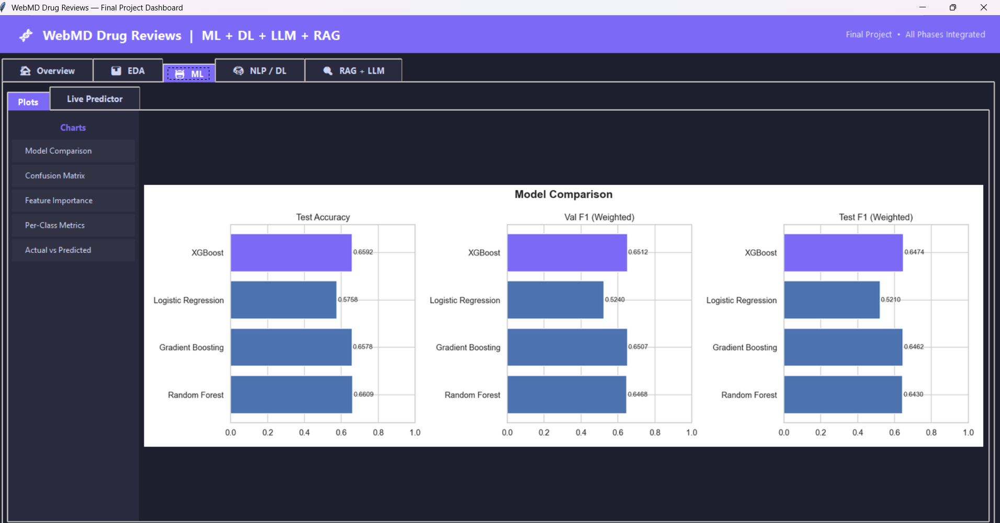

### NLP / DL Tab

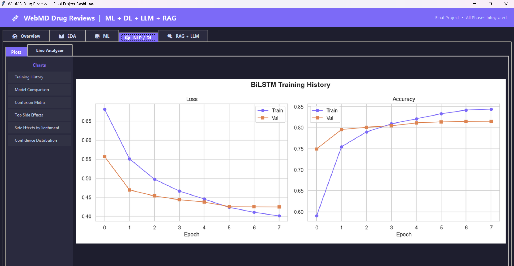

### RAG + LLM Tab


---

## Plot Gallery

### Phase 1 — EDA

<table>
<tr>
<td>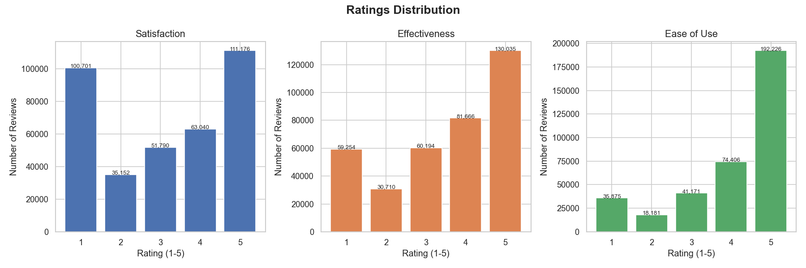</td>
<td>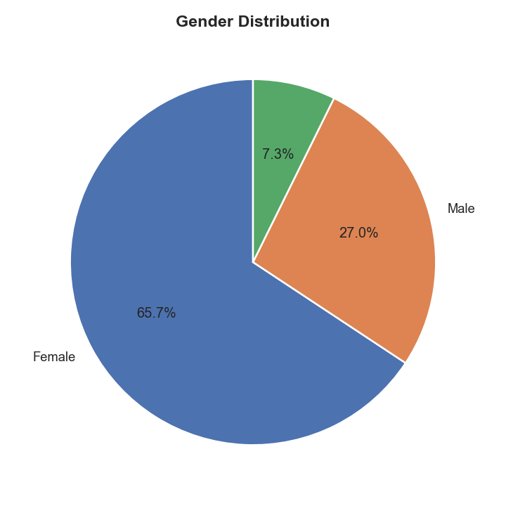</td>
</tr>
<tr>
<td align="center"><em>Ratings Distribution</em></td>
<td align="center"><em>Gender Distribution</em></td>
</tr>
<tr>
<td>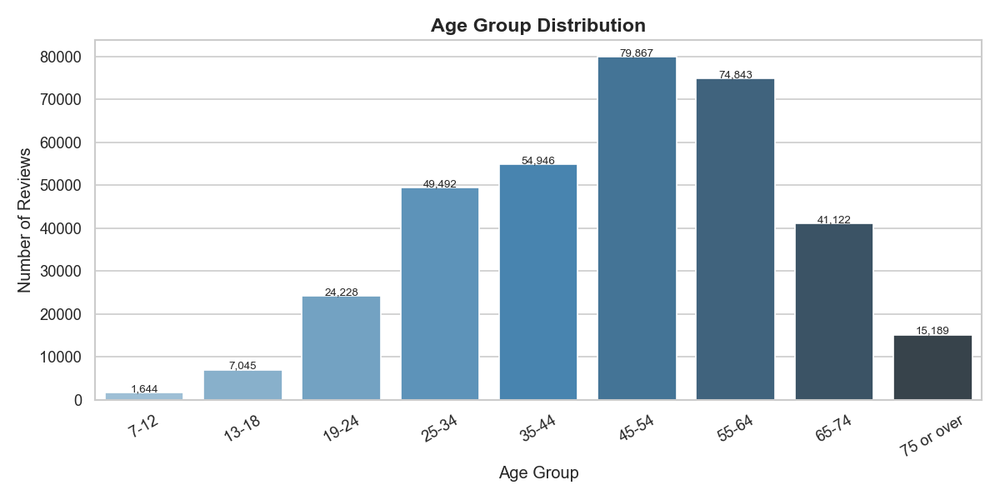</td>
<td>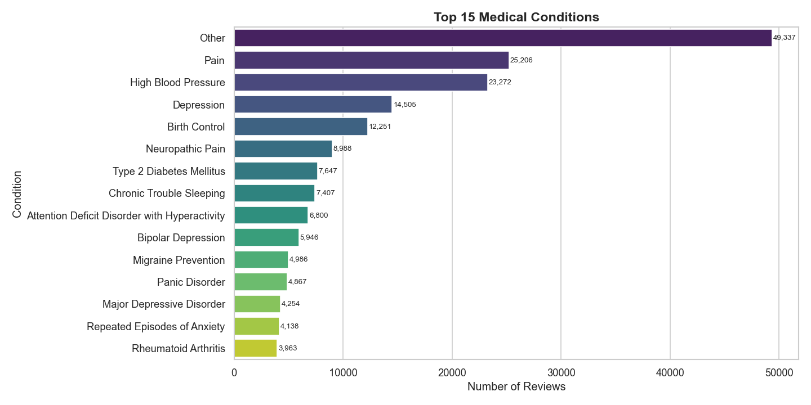</td>
</tr>
<tr>
<td align="center"><em>Age Group Distribution</em></td>
<td align="center"><em>Top 15 Medical Conditions</em></td>
</tr>
<tr>
<td>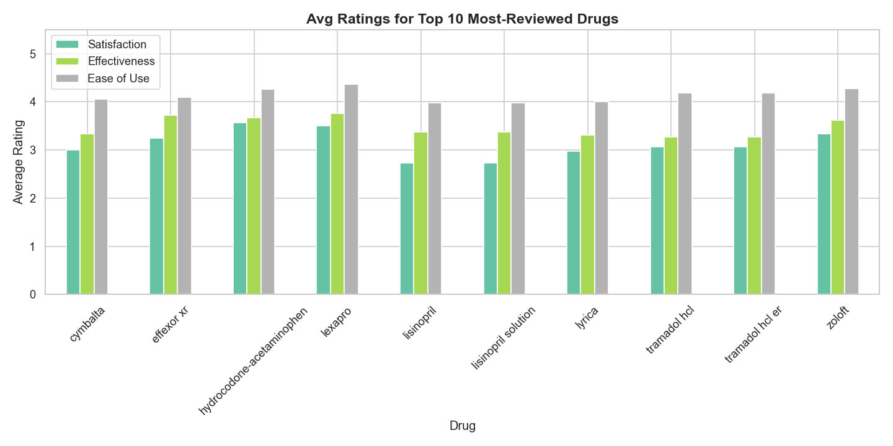</td>
<td>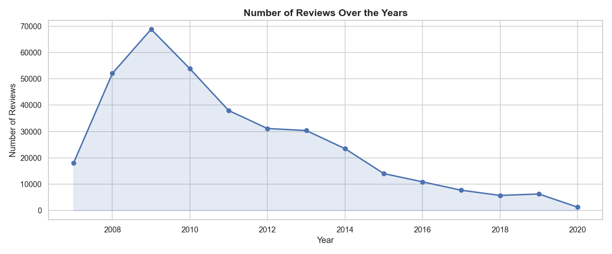</td>
</tr>
<tr>
<td align="center"><em>Avg Ratings — Top 10 Drugs</em></td>
<td align="center"><em>Reviews Over the Years</em></td>
</tr>
<tr>
<td>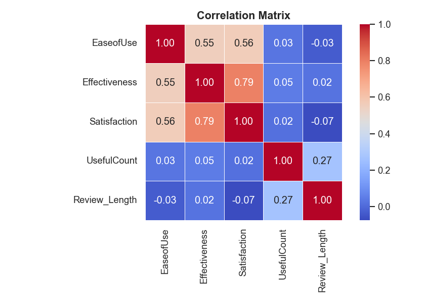</td>
<td>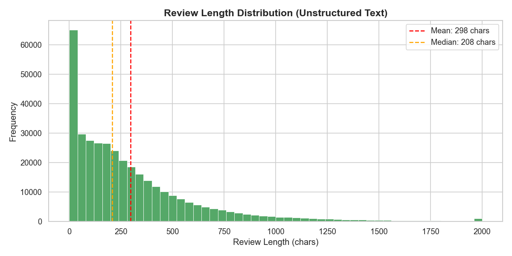</td>
</tr>
<tr>
<td align="center"><em>Correlation Heatmap</em></td>
<td align="center"><em>Review Length Distribution</em></td>
</tr>
</table>

### Phase 2 — Machine Learning

<table>
<tr>
<td>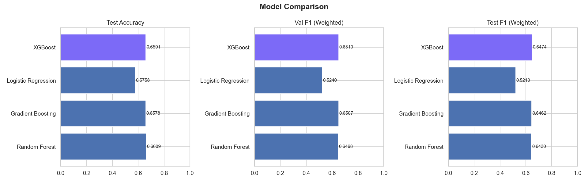</td>
<td>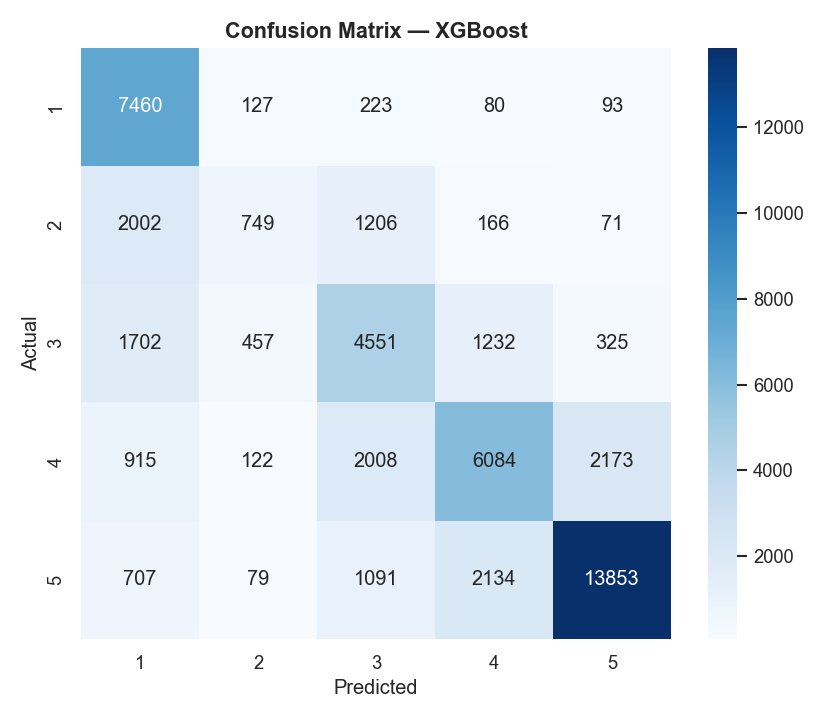</td>
</tr>
<tr>
<td align="center"><em>Model Comparison (Accuracy / F1)</em></td>
<td align="center"><em>Confusion Matrix — Best Model</em></td>
</tr>
<tr>
<td>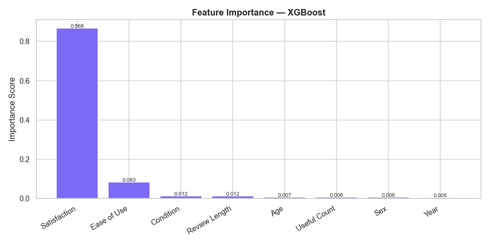</td>
<td>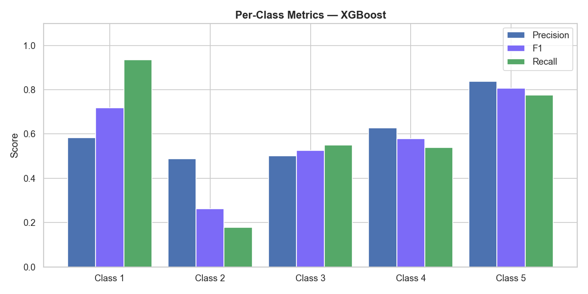</td>
</tr>
<tr>
<td align="center"><em>Feature Importance</em></td>
<td align="center"><em>Per-Class Precision / F1 / Recall</em></td>
</tr>
<tr>
<td colspan="2" align="center">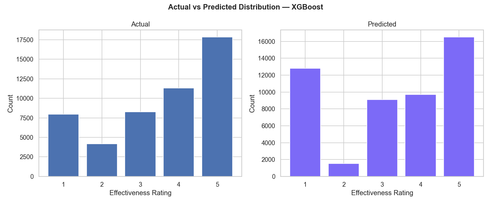</td>
</tr>
<tr>
<td colspan="2" align="center"><em>Actual vs Predicted Distribution</em></td>
</tr>
</table>

### Phase 3 — NLP / Deep Learning

<table>
<tr>
<td>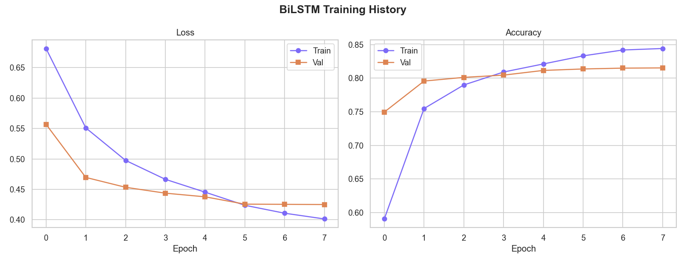</td>
<td>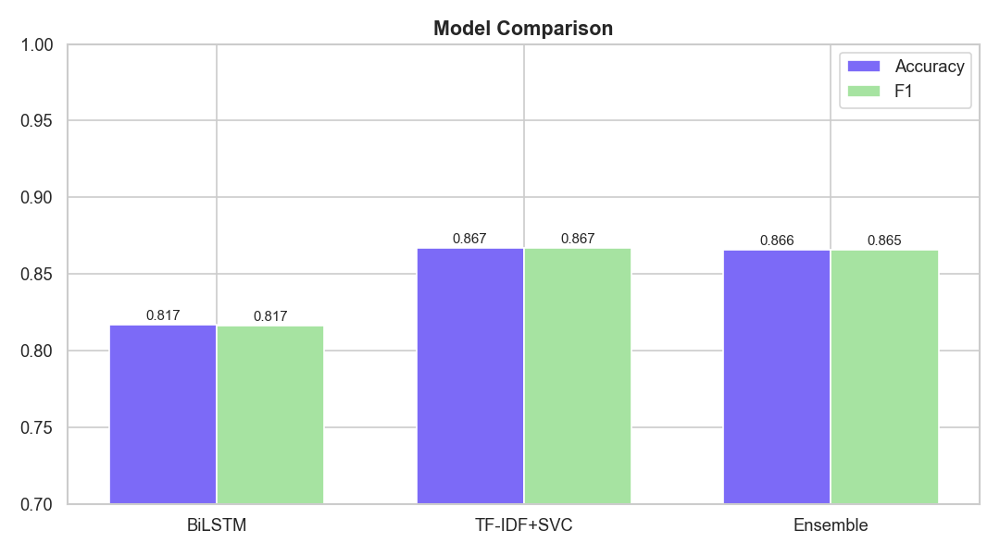</td>
</tr>
<tr>
<td align="center"><em>BiLSTM Training History</em></td>
<td align="center"><em>Model Comparison (BiLSTM / TF-IDF / Ensemble)</em></td>
</tr>
<tr>
<td>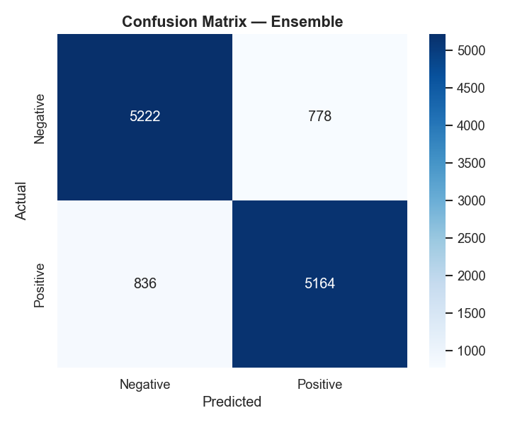</td>
<td>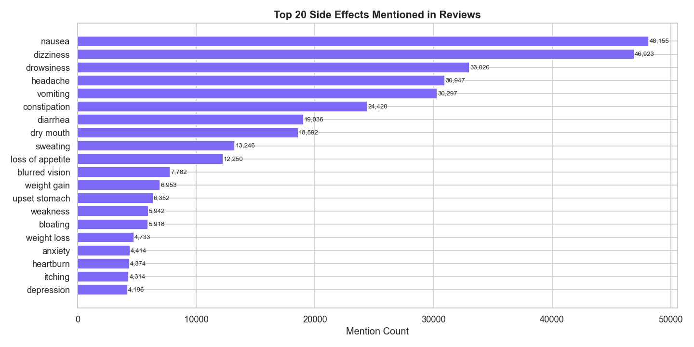</td>
</tr>
<tr>
<td align="center"><em>Confusion Matrix — Ensemble</em></td>
<td align="center"><em>Top 20 Side Effects Mentioned</em></td>
</tr>
<tr>
<td>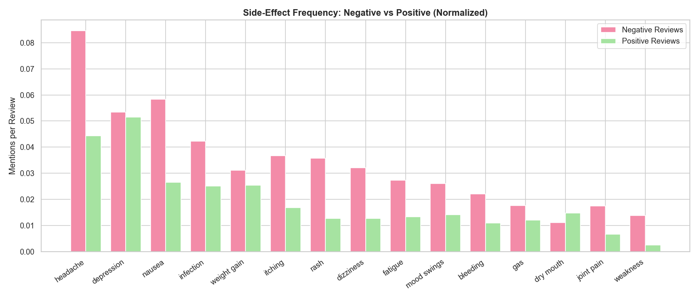</td>
<td>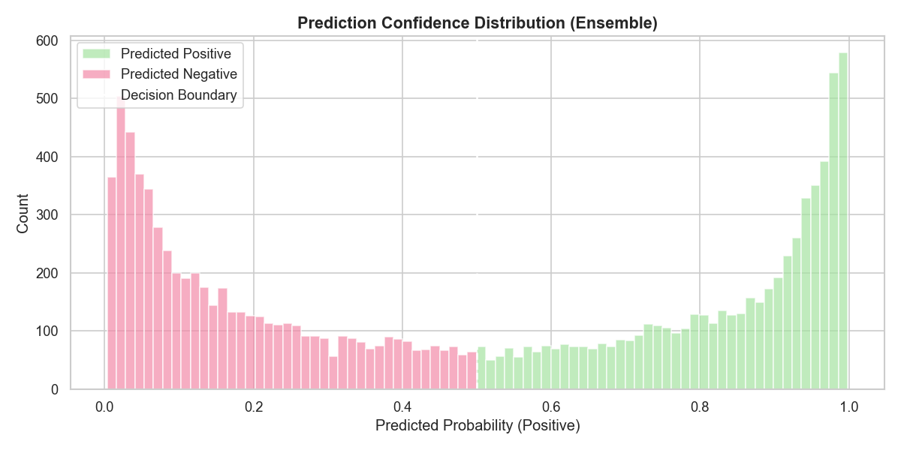</td>
</tr>
<tr>
<td align="center"><em>Side Effects: Negative vs Positive Reviews</em></td>
<td align="center"><em>Prediction Confidence Distribution</em></td>
</tr>
</table>

---

## LLM Integration (optional)

The RAG tab works without an API key — it falls back to a structured template response. To enable LLM-generated summaries:

1. Get a free API key at [openrouter.ai](https://openrouter.ai)
2. Create a `.env` file in the project root:

```env
OPENROUTER_API_KEY=your_key_here
OPENROUTER_MODEL=nvidia/nemotron-3-super-120b-a12b:free
```

The key is read from the environment at startup and never hardcoded in source.

---

## Pipeline Details

### Phase 1 — EDA

Cleaning steps applied to the raw CSV:
- Fill missing text columns (`Age`, `Condition`, `Sex`, `Sides`, `Reviews`) with `"Unknown"`
- Fill missing numeric ratings with column median
- Parse `Date` → extract `Year`
- Compute `Review_Length` as character count
- Drop duplicate rows
- Filter out-of-range ratings (outside 1–5)

### Phase 2 — Machine Learning

**Task:** Predict drug `Effectiveness` rating (1–5) as a 5-class classification problem.

**Features:** Age (numeric midpoint), Sex (binary), Condition (label-encoded top-50), EaseofUse, Satisfaction, UsefulCount, Year, Review_Length

**Models:** Random Forest (200 trees), Gradient Boosting (100 estimators), Logistic Regression (StandardScaler pipeline), XGBoost (300 estimators, 0-indexed labels)

**Split:** 70% train / 15% val / 15% test (stratified). Best model selected by weighted F1 on test set.

### Phase 3 — Deep Learning NLP

**Task:** Binary sentiment classification (Positive = Satisfaction ≥ 4, Negative = Satisfaction ≤ 2, neutral class 3 dropped).

**TF-IDF ensemble (primary — 80% weight):**
- Word n-grams (1–3) + char n-grams (2–4), 150k features each
- CalibratedClassifierCV(LinearSVC) + LogisticRegression (SAGA)
- Ensemble: 50% SVC + 50% LR probabilities

**BiLSTM (secondary — 20% weight):**
- Vocabulary: 30,000 tokens, max sequence length: 150
- Architecture: `Embedding(128) → SpatialDropout(0.5) → BiLSTM(32) → Dense(16, ReLU) → Dropout(0.6) → Sigmoid`
- EarlyStopping (patience=2), ReduceLROnPlateau

**Side-effect detection:** Negation-aware keyword matching against 49 medical terms. Checks a 5-word window before each keyword for negation terms (`not`, `never`, `without`, etc.).

### Phase 4+5 — RAG + LLM

**Embedding:** `all-MiniLM-L6-v2` (SentenceTransformers), cosine similarity

**Vector store:** ChromaDB with HNSW index, 50,000 reviews indexed in batches of 512

**Document format:** Each document combines drug name, condition, sentiment label, effectiveness rating, side effects, and review text — enabling rich semantic matching.

**Retrieval:** Semantic search with optional drug name and condition metadata filters, configurable top-k (default: 7)

**LLM:** OpenRouter API (OpenAI-compatible). System prompt instructs the model to summarise only from retrieved context. Falls back to a structured Arabic-language template if no key is set or the call fails.

---

## Models & Results

| Phase | Model | Metric |
|---|---|---|
| ML | XGBoost (best) | Test F1 ≈ 0.647 (5-class effectiveness) |
| NLP | TF-IDF Ensemble | ~90%+ accuracy on binary sentiment |
| NLP | BiLSTM | Secondary model, 20% ensemble weight |
| NLP | Ensemble (80/20) | Best overall accuracy and F1 |
| RAG | all-MiniLM-L6-v2 | Cosine similarity retrieval |

Exact metric values are printed to console during training.

---

## Tech Stack

| Layer | Tools |
|---|---|
| Packaging | hatchling, uv, Python 3.11 |
| Data | pandas 2.3, numpy 1.26, scipy 1.17 |
| Visualisation | matplotlib 3.10, seaborn 0.13 |
| ML | scikit-learn 1.8, xgboost 2.1, joblib 1.5 |
| Deep learning | tensorflow 2.21, nltk 3.9 |
| Embeddings | sentence-transformers 3.4, transformers 4.57, torch 2.11 |
| Vector store | chromadb 0.6 |
| LLM | openai 1.109 (OpenRouter) |
| GUI | tkinter (stdlib), Pillow 10.4 |
| Config | python-dotenv 1.2 |

---

## Environment Variables

| Variable | Required | Description |
|---|---|---|
| `OPENROUTER_API_KEY` | No | Enables LLM answer generation in the RAG tab |
| `OPENROUTER_MODEL` | No | Override the default LLM model (default: `nvidia/nemotron-3-super-120b-a12b:free`) |

---

## Troubleshooting

**`uv sync` fails with certificate error**
```bash
uv sync --native-tls
```

**`webmd-eda` fails with FileNotFoundError**
Make sure `data/src/webmd.csv` exists. Download from Kaggle.

**`webmd-app` tab shows "Artifact not found"**
Run the phases in order first: `webmd-eda` → `webmd-ml` → `webmd-nlp` → `webmd-rag`

**`webmd-setup` / `webmd-rag` fails with SSL certificate error on HuggingFace download**
The `all-MiniLM-L6-v2` model is downloaded from HuggingFace on first use. On machines with corporate certificates, set the CA bundle before running:
```bash
# Windows PowerShell
$env:REQUESTS_CA_BUNDLE = "C:\path\to\your\ca-bundle.crt"
uv run webmd-setup

# Or disable SSL verification (not recommended for production)
$env:CURL_CA_BUNDLE = ""
```
Alternatively, pre-download the model manually and set `SENTENCE_TRANSFORMERS_HOME` to point to the local cache.

**BiLSTM training is slow**
Expected on CPU (~15–20 min). EarlyStopping will cut it short if val_loss stops improving. A CUDA GPU reduces this to ~3–5 min.

**`webmd-rag` index build takes a long time**
Only on first run. The index is persisted to `chroma_db/` and loaded instantly on subsequent runs.

**TensorFlow warnings on startup**
Set `TF_CPP_MIN_LOG_LEVEL=3` in your environment to suppress them. The CLI entry points set this automatically.

**ChromaDB telemetry warning: `capture() takes 1 positional argument`**
Harmless internal bug in chromadb 0.6.x. Does not affect functionality.

---

## License

MIT License — see `LICENSE` for details.
